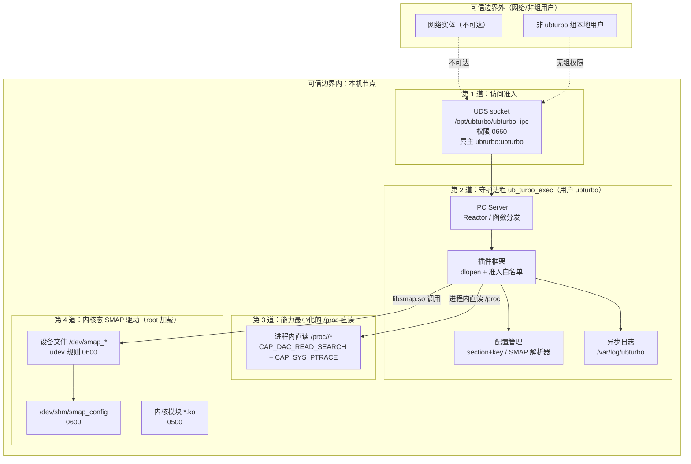

# UBTurbo 安全说明

## 信任模型

UBTurbo 是面向单节点（openEuler Linux / aarch64）的节点内资源管理守护进程，其部署形态与信任边界如下：

1. **节点内信任**：UBTurbo 仅在单机节点内运行，对外通信完全基于 Unix Domain Socket（UDS），**不监听任何网络端口、不提供 TLS 加密通道、不实现基于角色的访问控制（RBAC）**。调用方（本机进程）默认被视为可信主体，可信前提是：调用进程的执行用户已被加入 `ubturbo` 用户组。

2. **职责分层信任**：UBTurbo 将"内存冷热识别与迁移"这一高风险特权操作下沉到 SMAP 内核态驱动完成，用户态守护进程 `ub_turbo_exec` 自身以**普通系统账户 `ubturbo`** 运行，仅持有读取 `/proc` 所需的两项低阶能力（`CAP_DAC_READ_SEARCH`、`CAP_SYS_PTRACE`），不持有 `CAP_SYS_ADMIN` 等高阶能力。内核态驱动以 root 身份加载并创建设备文件后，通过 udev 规则将设备属主移交 `ubturbo:ubturbo` 并收紧为 `0600`，用户态仅持有"已降权设备"的访问句柄。

3. **最小能力授权**：UBTurbo 需读取受保护进程的 `/proc/<pid>/*` 信息用于迁移决策，该操作受 Linux `/proc` 默认权限约束。为此由 systemd 授予两项最小能力（`CAP_DAC_READ_SEARCH` 绕过 DAC 读取其他 uid 拥有的 `/proc/<pid>/*`、`CAP_SYS_PTRACE` 绕过 ptrace 访问校验），守护进程启动时再由进程内安全模块将能力收敛到该最小集，随后**进程内直读 `/proc`**——不使用 `sudo`、不依赖任何辅助脚本。

4. **可信边界之外**：节点之外的网络实体、非 `ubturbo` 组的本地用户、未登记在准入白名单中的插件 `.so`，均处于可信边界之外，不具备任何可直接触达 UBTurbo 服务的入口。

## 安全架构

UBTurbo 的安全防线自外向内分层部署，如下图所示：

整体安全设计遵循"默认降权 + 最小暴露 + 能力最小化 + 文件权限兜底"四原则：进程降权到普通账户、内核设备文件收紧到 `0600`、仅授予读取 `/proc` 所需的两项能力并在进程内收敛、所有关键路径以文件系统权限作为最后防线。

## 最小权限原则

UBTurbo 自始至终贯彻最小权限：

1. **进程账户降权**：`ub_turbo_exec` 由 systemd 以 `User=ubturbo / Group=ubturbo` 启动，`AmbientCapabilities` 与 `CapabilityBoundingSet` 仅授予 `CAP_DAC_READ_SEARCH`、`CAP_SYS_PTRACE` 两项能力，不持有其他任何 capability；`NoNewPrivileges=yes` 杜绝运行期经由 execve 获取新特权。守护进程启动后由进程内安全模块（`TurboModuleSecurity`，位于模块初始化首位）经 `capget`/`capset` 将 permitted+effective 能力进一步收敛到该最小集。

2. **设备属主移交**：内核模块以 root 加载后创建的字符设备文件，由 udev 规则 `99-smap.rules` 统一设置 `OWNER="ubturbo" GROUP="ubturbo" MODE="0600"`，仅属主可读写，组用户与其他用户均无任何权限。

3. **配置与日志隔离**：配置目录 `/opt/ubturbo/conf` 权限 `700`、日志目录 `/var/log/ubturbo` 权限 `700`，仅 `ubturbo` 用户可进入；内部文件统一 `600`，杜绝同机其他用户窥探或篡改策略。

4. **能力收敛**：所有需越过 `/proc` 默认权限的读取，仅依赖 `CAP_DAC_READ_SEARCH` + `CAP_SYS_PTRACE` 两项能力，由 systemd 授予并在进程内安全模块启动时收敛；读取路径固定为 `/proc/<pid>/{numa_maps,comm,cmdline}`，经 `fopen`/`GetFileInfo` 直读，不引入 shell、不拼接命令、不依赖辅助脚本，从根本上规避命令注入。

5. **资源边界**：systemd 单元设置 `MemoryMax=30G`，对守护进程内存用量做上界约束，避免异常场景下的内存失控。

## 程序特权说明

UBTurbo 体系内的可执行/库文件及其特权配置如下：

| 程序/库 | 运行/属主 | 权限 | 特权来源 | 说明 |
| :--- | :--- | :--- | :--- | :--- |
| `ub_turbo_exec`（守护进程） | `ubturbo:ubturbo` | `500` | systemd `User=ubturbo` + `AmbientCapabilities` | 主守护进程，仅持有 `CAP_DAC_READ_SEARCH`、`CAP_SYS_PTRACE` 两项能力（启动后进程内收敛），负责加载插件、IPC、配置、日志。 |
| `libubturbo_client.so`（客户端 SDK） | `ubturbo:ubturbo` | `550` | 文件权限 | 外部进程经此库调用 UDS；需调用方用户属于 `ubturbo` 组方能访问 socket。 |
| `libsmap.so`（SMAP 用户态库） | `ubturbo:ubturbo` | `0500` | 文件权限 | 守护进程通过 `dlopen` 加载，内部封装对内核设备的调用与对 `/proc/<pid>/*` 的直读。 |
| `*.ko`（SMAP 内核模块） | `ubturbo:ubturbo` | `0500` | 内核态 | 以 root 加载到内核，运行于内核态，用户态仅经设备文件交互。 |

## 文件与目录权限

### UBTurbo 主框架（`ubturbo-rmrs` 组件）

| 路径 | 权限 | 属主 | 说明 |
| :--- | :--- | :--- | :--- |
| `/opt/ubturbo` | `750` | `ubturbo:ubturbo` | 安装根目录，仅属主可读写执行，组用户可进入。 |
| `/opt/ubturbo/bin` | `500` | `ubturbo:ubturbo` | 守护进程二进制目录。 |
| `/opt/ubturbo/bin/ub_turbo_exec` | `500` | `ubturbo:ubturbo` | 守护进程可执行文件。 |
| `/opt/ubturbo/lib` | `500` | `ubturbo:ubturbo` | 插件 `.so` 目录。 |
| `/opt/ubturbo/lib/*.so` | `500` | `ubturbo:ubturbo` | 各插件共享库。 |
| `/opt/ubturbo/conf` | `700` | `ubturbo:ubturbo` | 配置目录，仅属主可访问。 |
| `/opt/ubturbo/conf/*` | `600` | `ubturbo:ubturbo` | 各配置文件。 |
| `/opt/ubturbo/ubturbo_ipc` | `660` | `ubturbo:ubturbo` | UDS socket 文件，由守护进程 `bind` 后 `chmod 0660`。 |
| `/var/log/ubturbo` | `700` | `ubturbo:ubturbo` | 日志目录。 |
| `/var/log/ubturbo/*` | `600` | `ubturbo:ubturbo` | 各日志文件。 |
| `/usr/lib64/libubturbo_client.so` | `550` | `ubturbo:ubturbo` | 对外客户端 SDK。 |
| `/etc/systemd/system/ubturbo.service` | `644` | `root:root` | systemd 单元文件。 |

### SMAP 内核组件（`ubturbo-smap` 组件）

| 路径 | 权限 | 属主 | 说明 |
| :--- | :--- | :--- | :--- |
| `/lib/modules/smap/*.ko` | `0500` | `ubturbo:ubturbo` | SMAP 内核模块。 |
| `/usr/lib64/libsmap.so` | `0500` | `ubturbo:ubturbo` | SMAP 用户态库。 |
| `/etc/udev/rules.d/99-smap.rules` | `0640` | `ubturbo:ubturbo` | udev 规则，设置设备属主与权限。 |
| `/dev/smap_device` | `0600` | `ubturbo:ubturbo` | SMAP 主设备。 |
| `/dev/smap_mig_device` | `0600` | `ubturbo:ubturbo` | 迁移设备。 |
| `/dev/smap_access_device` | `0600` | `ubturbo:ubturbo` | 访存采样设备。 |
| `/dev/smap_node0` ~ `smap_node21` | `0600` | `ubturbo:ubturbo` | 各 NUMA 节点设备。 |
| `/dev/ham_migrate` | `0600` | `ubturbo:ubturbo` | HAM 迁移设备。 |
| `/dev/ucache` | `0600` | `ubturbo:ubturbo` | UCache 迁移设备。 |
| `/dev/shm/smap_config` | `0600` | `ubturbo:ubturbo` | SMAP 运行期共享配置。 |

## 暴露面安全设计

UBTurbo 对外的可触达暴露面逐一收敛如下：

1. **IPC 暴露面（UDS socket）**
   - 仅暴露一个 socket：`/opt/ubturbo/ubturbo_ipc`，权限 `0660`，属主 `ubturbo:ubturbo`。
   - 鉴权机制为**文件权限 + 用户组**：只有属于 `ubturbo` 组的本地进程才能访问该 socket。**不实现 `SO_PEERCRED` 对端凭证校验，也不实现 RBAC**。调用方一旦具备组权限，即可调用所有已注册的 IPC 函数。
   - 函数分发层做基本健壮性校验：函数名非空、长度上限 `128`、不重复注册、消息长度区间 `[10, 32MB]`，越界请求被拒绝，防止报文层滥用。

2. **插件加载暴露面**
   - 插件通过 `dlopen` 从 `/opt/ubturbo/lib/` 加载，目录权限 `500`，仅 `ubturbo` 用户可写入。插件 `.so` 必须先被安装到该目录，物理上与配置白名单形成双重门控。
   - 逻辑上由 `ubturbo_plugin_admission.conf` 白名单控制：未登记或被 `#` 注释的插件不会被加载；`moduleCode` 必须 `> 200`，低于 `200` 的值保留给框架内部模块，配置后将导致加载异常退出。
   - 插件入口统一为 `TurboPluginInit(moduleCode)` / `TurboPluginDeInit()`，未提供任意符号导出以外的入口。

3. **配置暴露面**
   - 配置目录 `700`、文件 `600`，仅 `ubturbo` 用户可读写。SMAP 运行期共享配置 `/dev/shm/smap_config` 同样为 `0600`，避免同机其他进程窥探或篡改迁移策略。
   - 配置项读取时对取值做范围校验，越界值统一重置为默认值（详见《UBTurbo 配置说明》），不因畸形配置触发未定义行为。

4. **`/proc` 读取暴露面（能力授权）**
   - 读取受保护进程的 `/proc/<pid>/*` 仅依赖两项能力：`CAP_DAC_READ_SEARCH`（绕过 DAC 读取其他 uid 拥有的 `0400` 文件）与 `CAP_SYS_PTRACE`（绕过 ptrace 访问校验），由 systemd `AmbientCapabilities`/`CapabilityBoundingSet` 授予，`CapabilityBoundingSet` 将能力上界锁定为这两项，运行期无法扩充。
   - 守护进程启动时由进程内安全模块经 `capget`/`capset` 将 permitted+effective 收敛到该最小集；读取经 `fopen`/`GetFileInfo` 直读固定路径 `/proc/<pid>/{numa_maps,comm,cmdline}`，不引入 shell、不拼接命令、不依赖 `sudo` 或辅助脚本，从根本上规避命令注入。
   - `NoNewPrivileges=yes` 确保运行期任何 execve（如 `system("tar")`、`popen("numastat")` 等非特权程序）都不会获得额外权限。

5. **内核设备暴露面**
   - 所有 SMAP 字符设备经 udev 统一收敛为 `0600`，仅 `ubturbo` 用户可访问；其他本地用户与组用户均无权限。
   - 用户态对内核的数据交互通过read读取，配置交互经 `ioctl` 受控命令字完成（如 `_IOWR(100, 1, MigrateInfo)`），不暴露任意系统调用代理。

6. **日志暴露面**
   - 日志目录 `700`、文件 `600`，仅 `ubturbo` 用户可读；单文件上限 `200MB`、最多 `10` 个文件轮转，避免磁盘占用失控与日志信息泄露给同机其他用户。

## 安全管理

1. **账号管理**：`ubturbo` 为 RPM 安装时创建的系统账户，shell 为 `/sbin/nologin`，不可交互登录；仅作为服务运行身份存在。需调用 UBTurbo 的本机用户，由管理员手动加入 `ubturbo` 组，即获得 IPC 访问权限——这是 UBTurbo 唯一的"授权"动作。

2. **插件管理**：启停插件只需编辑 `/opt/ubturbo/conf/ubturbo_plugin_admission.conf`（注释/取消注释对应行），再 `systemctl restart ubturbo` 生效。新增插件需将其 `.so` 安装到 `/opt/ubturbo/lib/`、在白名单登记、并补齐对应 `plugin_*.conf`，三步缺一不可。

3. **策略管理**：SMAP 策略经 `/opt/ubturbo/conf/smap/period.config` 在线调整；仅当 `smap.period.file.config.switch = true` 时文件配置才逐周期覆盖内存生效配置，`false` 时仅读取不覆盖，便于在变更窗口后冻结策略。

4. **变更管理**：SMAP 配置变更为热加载，其余配置均需重启服务生效（`systemctl restart ubturbo`）；切换运行用户或切换场景时，需先清理 `/dev/shm/smap_config` 与 `/dev/shm/ubturbo_page_type.dat`，避免读到旧用户/旧场景的残留状态。

## 通信矩阵

UBTurbo 体系内各主体间的通信关系如下：

| 通信路径 | 协议/方式 | 端口/路径 | 鉴权机制 | 加密 | 说明 |
| :--- | :--- | :--- | :--- | :--- | :--- |
| 外部进程 ↔ 守护进程 | UDS（`AF_UNIX/SOCK_STREAM`） | `/opt/ubturbo/ubturbo_ipc` | socket 文件权限 `0660` + `ubturbo` 用户组 | 无 | 唯一对外入口；JSON 序列化经 `TurboByteBuffer` 传输。 |
| 守护进程 ↔ 插件 | 进程内 `dlopen` 调用 | `/opt/ubturbo/lib/*.so` | 文件权限 `500` + 准入白名单 | — | 插件与守护进程同进程，无跨进程通信。 |
| 守护进程/插件 ↔ SMAP 内核 | 字符设备 `ioctl` | `/dev/smap_*`、`/dev/ucache` | 设备文件权限 `0600` | — | 经 udev 设置属主为 `ubturbo`，仅属主可访问。 |
| 守护进程 ↔ 配置 | 文件读 | `/opt/ubturbo/conf/*` | 目录 `700` / 文件 `600` | — | 启动与周期性读取。 |
| 守护进程 ↔ 日志 | 文件写 | `/var/log/ubturbo/*` | 目录 `700` / 文件 `600` | — | 异态环形缓冲写入。 |
| 守护进程 ↔ systemd | D-Bus / 进程管理 | `/etc/systemd/system/ubturbo.service` | root | — | 服务自启动、重启、资源约束与能力（capability）授予。 |

## 系统账号

| 账号 | 类型 | shell | 用途 | 创建方式 |
| :--- | :--- | :--- | :--- | :--- |
| `ubturbo` | 系统账户（服务账户） | `/sbin/nologin` | 守护进程运行身份、内核设备属主、IPC socket 属主、`CAP_DAC_READ_SEARCH`/`CAP_SYS_PTRACE` 能力持有者 | `ubturbo-rmrs` RPM 安装时创建 |
| `root` | 系统账户 | — | 内核模块加载、systemd 单元管理与能力授予 | 系统默认 |

`ubturbo` 账户不可交互登录，仅服务于 UBTurbo 进程；其权限边界由文件系统权限、udev 规则、systemd 能力配置共同界定，仅持有读取 `/proc` 所需的 `CAP_DAC_READ_SEARCH`、`CAP_SYS_PTRACE` 两项能力（且经进程内安全模块收敛），不再依赖 sudoers。任何需要调用 UBTurbo 的本机用户，经管理员加入 `ubturbo` 组即可获得 IPC 访问权限，无需额外凭证。
